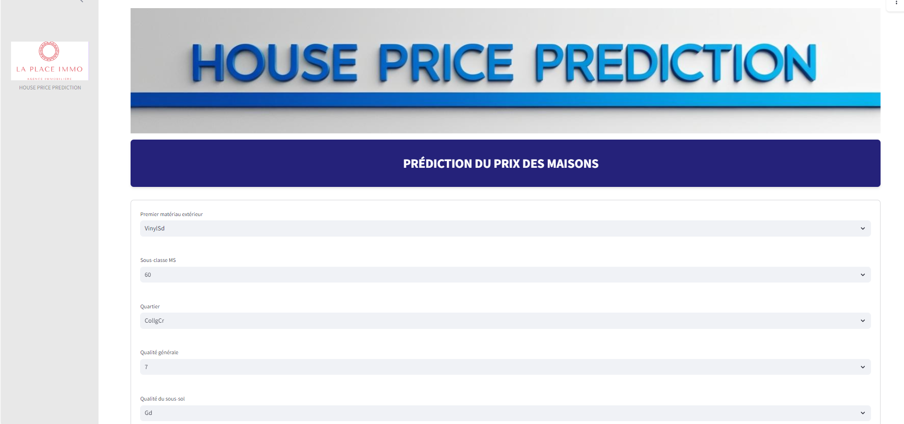

# HOUSE PRICE PREDICTION (LAPLACE IMMO)


Ce projet a ete realise dans le cadre du cours d'introduction au machine learning (IML) faite en ISE2 a l'Ecole Nationale de la Statistique et de l'Analyse economique Pierre NDIAYE de Dakar au premier semestre.

## Table des matieres
- [Objectif](#objectif)
- [Structure du projet](#structure-du-projet)
- [Methodologie](#methodologie)
- [Execution du projet](#execution-du-projet)
- [Auteurs](#auteurs)

## Objectif

Ce projet a pour principal objectif de predire les prix des appartements a partir de certaines caracteristiques a la fois : les caractéristiques Générales du Bâtiment, les Informations sur le Terrain, l'État et la Qualité, les Caractéristiques Intérieures, les Caractéristiques Extérieures et les Informations de Vente.

## Structure du projet 

1. Le dossier `Data` contient les donnees utilisees dans le cadre de ce projet. Les donnees brutes sont dans le dossier `Raw` et les donnees traitees dans le dossier `Precessed`

2. Le dossier `Notebooks` contient les notebooks de traitement des donnees et du choix du modeles

3. Le dossier `Src` contient les potentiels Scripts necessaires au projet

4. Le dossier `Streamlit_App` contient l'application streamlit.

## Methodologie

- Analyse exploratoire
- Feature engeneering
- Test et choix des modeles
- Application sur Streamlit 

## Installation et Configuration

1. Clonez le dépôt et placez-vous dans le dossier AuchanScraping via un terminal :
   ```bash
   git clone https://github.com/LarrySANDJO/House_Price_Prediction_Repo
   ```

2. Créez un environnement virtuel et activez-le :

   ```bash
   python -m venv venv
   source venv\bin\activate    # Sur MacOS/Linux
   source venv/Scripts/activate       # Sur Windows
   ```

3. Installez les dépendances :
   ```bash
   pip install -r requirements.txt
   ```

## Execution du projet

Les notes decrivent tut le processus de traitement des donnees et de choix du modele. Ils sont consultables a partir du dossier Notebooks

Pour executer l'application :

1. Allez dans le dossier Streamlit_App :

    ```bash
    cd Streamlit_App
    ```
2. Lancez l'application :

    ```bash
    streamlit run app.py
    ```


## Auteurs 

Les auteurs de ce projet sont essentiellement les _eleves ingenieurs statisticiens economistes_ d'ISE2 2024-2025. Il s'agit de :

- Lesline KENNE
- Yamin KOLAMBIGUE
- Anna ATCHOU
- Larry SANDJO

Sous la supervision de **Mme Mously DIAW**, *Data Scientist*



